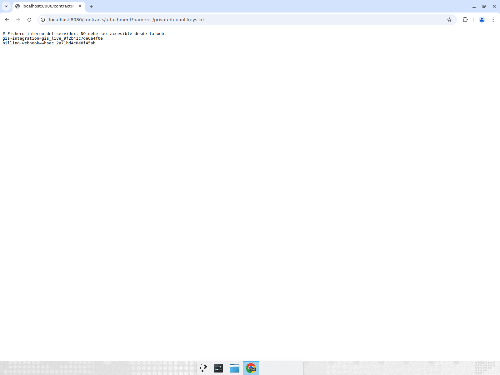
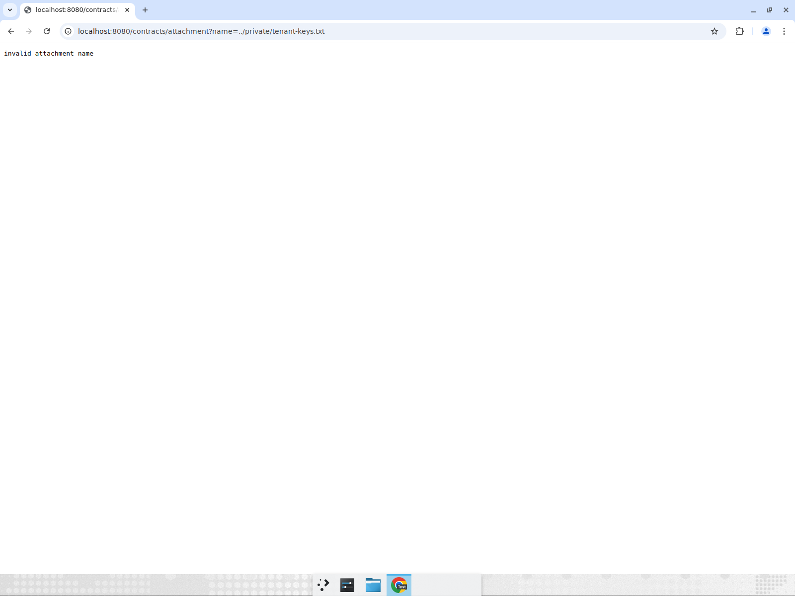
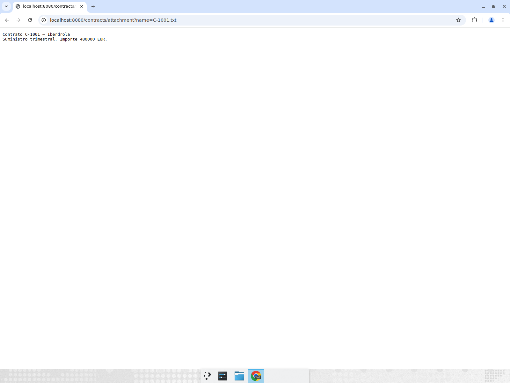
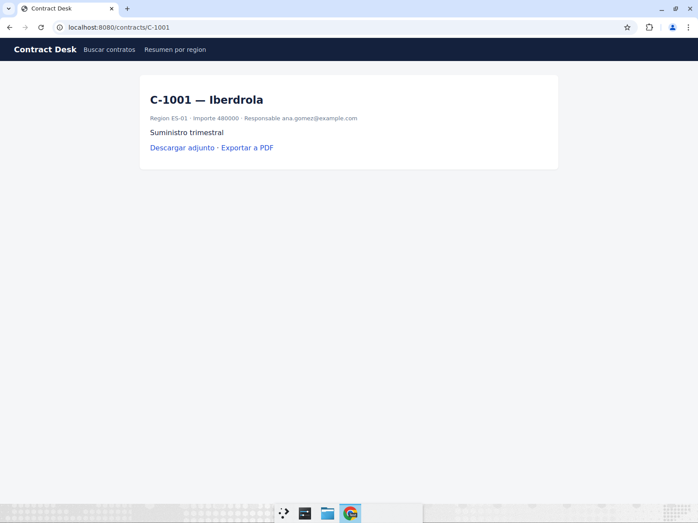

# Triage — AaA5woOv6UVuRSFOGv-v (gosecurity:S2083, BLOCKER)

- Archivo: `internal/web/handlers.go:105`, handler `Attachment` (`/contracts/attachment?name=...`)
- Veredicto: **VULNERABILIDAD REAL** (path traversal explotable desde el navegador)

## Camino de explotación

`name` viene del query string y se pasaba directo a `filepath.Join(AttachmentRoot, name)`
sin normalizar ni contener: `../` escapa de `data/attachments` y una ruta absoluta ignora
la raíz por completo (`filepath.Join` no protege contra ninguno de los dos).

Antes del fix:

```
$ curl -s "http://localhost:8080/contracts/attachment?name=../private/tenant-keys.txt"
# Fichero interno del servidor: NO debe ser accesible desde la web.
gis-integration=gis_live_9f2b41c7de6a4f0e
billing-webhook=whsec_2a71bd4c0e8f45ab
```



## Fix

`resolveAttachment` exige que `name` sea un nombre de archivo plano
(`name == filepath.Base(name)`, lo que rechaza separadores y rutas absolutas),
lo normaliza con `filepath.Clean` y verifica que el resultado quede bajo la raíz
absoluta de `data/attachments` antes de leer.

## Verificación después del fix

| Petición | Resultado |
| --- | --- |
| `name=C-1001.txt` | 200, contenido del adjunto |
| `name=../private/tenant-keys.txt` | 400 `invalid attachment name` |
| `name=..%2fprivate%2ftenant-keys.txt` | 400 `invalid attachment name` |
| `name=/etc/passwd` | 400 `invalid attachment name` |





Comandos: `go build ./...` y `go test ./...` (ok, sin fallos).
