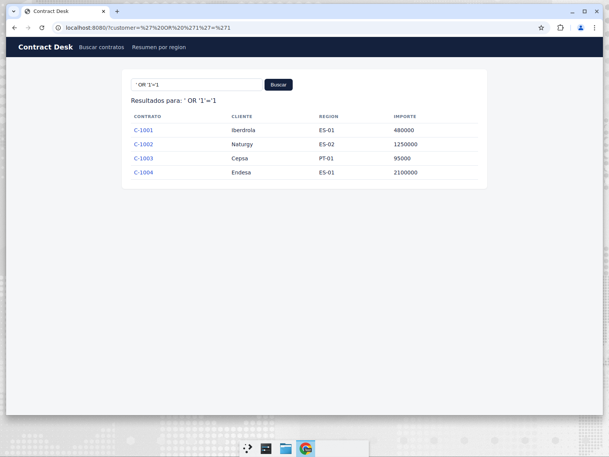
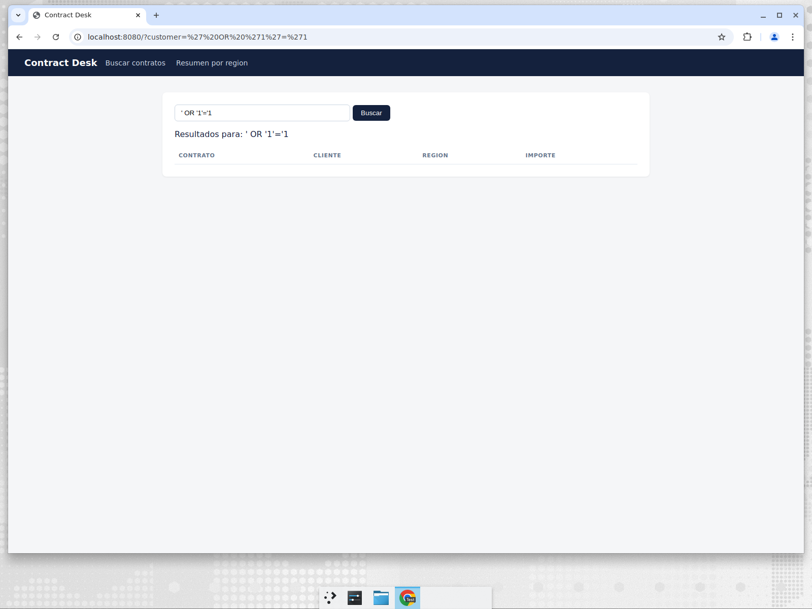
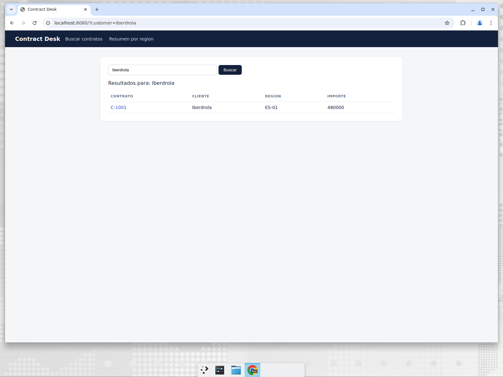
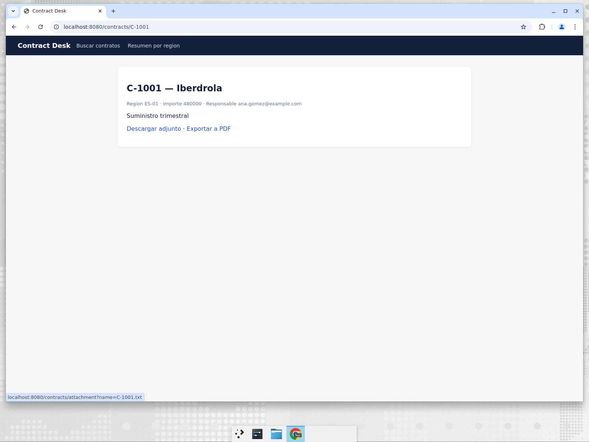

# Verificación — finding AaA5woMw6UVuRSFOGv-o (go:S2077)

- Regla: `go:S2077` "SQL queries should not be dynamically formatted" (VULNERABILITY, MAJOR)
- Ubicación: `internal/contracts/repository.go`, `FindByCustomer`
- Veredicto: **VULNERABILIDAD REAL** (SQL injection explotable desde el buscador `/`)

## Camino de explotación

`GET /` → `web.(*Server).Search` toma `r.URL.Query().Get("customer")` sin validar y lo pasa a
`contracts.FindByCustomer`, que armaba el query con `fmt.Sprintf`:

```go
query := fmt.Sprintf("SELECT %s FROM contracts WHERE customer LIKE '%%%s%%'", selectColumns, customer)
```

Como el parámetro se interpola dentro de literales de string, el atacante cierra la comilla y cambia
la semántica del `WHERE`.

## Antes del fix

`http://localhost:8080/?customer=' OR '1'='1` devuelve **los 4 contratos** de la base, incluidos los
de clientes que el usuario no buscó (fuga de datos completa de la tabla).



Comprobación por CLI (filas de resultado en el HTML): payload → 4 contratos; `?customer=Endesa` → 1.

## Fix

Query parametrizada; el patrón `LIKE` se pasa como argumento, no como texto del query:

```go
rows, err := db.Query("SELECT "+selectColumns+" FROM contracts WHERE customer LIKE ?", "%"+customer+"%")
```

`selectColumns` es una constante del propio código (no entrada de usuario), igual que en `GetByID`.

## Después del fix

Mismo payload, misma URL: 0 resultados — la comilla se trata como dato literal del cliente buscado.



El flujo legítimo sigue funcionando: búsqueda de `Iberdrola` devuelve su contrato y el detalle abre bien.





## Comandos ejecutados

- `go build ./...` → OK
- `go test ./...` → OK (`internal/contracts` ok, resto sin tests)
- `go run ./cmd/api` + verificación en navegador (Chrome) sobre `http://localhost:8080`
