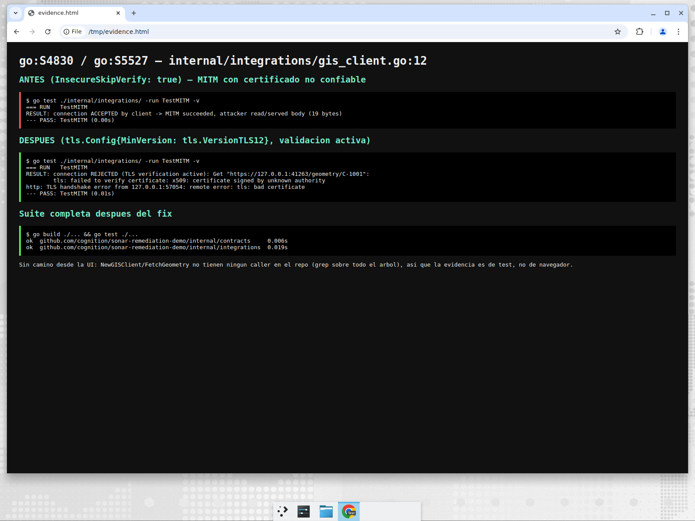
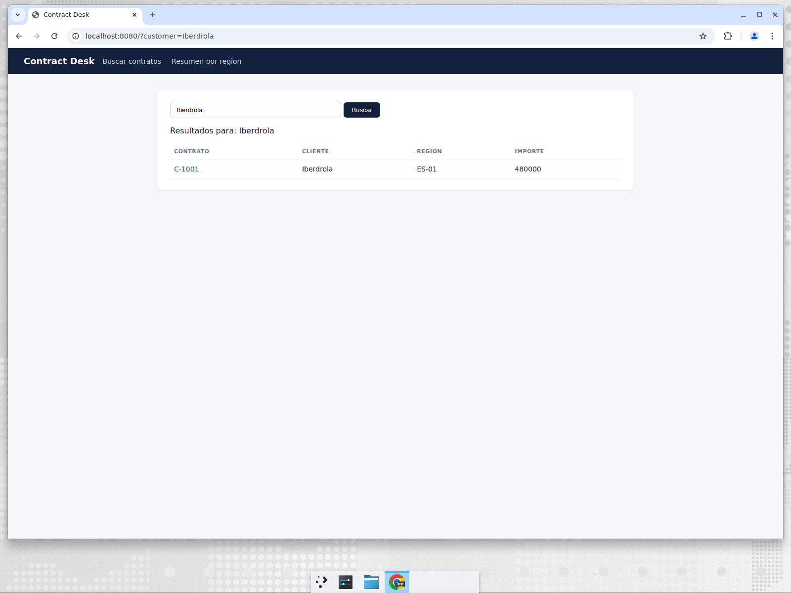

# Verificación — AaA5woO56UVuRSFOGv-x (go:S4830) y AaA5woO56UVuRSFOGv-y (go:S5527)

Archivo: `internal/integrations/gis_client.go:12`

## Veredicto

Ambos findings son **vulnerabilidad real**. La configuración era
`&tls.Config{InsecureSkipVerify: true}`, que en Go desactiva a la vez la
validación de la cadena de confianza (S4830) y la verificación del hostname
(S5527) — no son dos controles independientes, el mismo flag apaga los dos.

## Camino de explotación

`NewGISClient()` es el cliente HTTP con el que `FetchGeometry` habla con el
backend GIS por HTTPS. Con la verificación apagada, cualquier atacante en el
camino de red (DNS spoofing, proxy, red comprometida) puede presentar un
certificado propio: el cliente lo acepta, y el atacante lee y modifica la
geometría de los contratos en tránsito.

**Sin camino desde la UI:** `NewGISClient`/`FetchGeometry` no tienen ningún
caller en el repo (grep sobre todo el árbol Go), así que ninguna página llega a
la línea. Eso no cambia el veredicto: el defecto está en el código del cliente y
se dispara en cuanto se lo use. La prueba es por test, no por navegador.

## Reproducción (antes del fix)

Test que levanta un servidor HTTPS con certificado autofirmado y hostname que no
coincide — exactamente lo que presentaría un MITM:

```
=== RUN   TestMITM
RESULT: connection ACCEPTED by client -> MITM succeeded, attacker read/served body (19 bytes)
```

## Fix

`&tls.Config{MinVersion: tls.VersionTLS12}`: se elimina `InsecureSkipVerify`,
con lo que Go valida la cadena contra el pool de CAs del sistema y verifica el
hostname; además se fija TLS 1.2 como mínimo.

## Después del fix

```
=== RUN   TestMITM
RESULT: connection REJECTED (TLS verification active): Get "https://127.0.0.1:41263/geometry/C-1001":
        tls: failed to verify certificate: x509: certificate signed by unknown authority
```

Se agregó `internal/integrations/gis_client_test.go` como test de regresión con
esa misma prueba.

## Comandos ejecutados

- `go build ./...` — ok
- `go test ./...` — ok (`internal/contracts`, `internal/integrations`)
- `go run ./cmd/api` + `http://localhost:8080/?customer=Iberdrola` — la búsqueda
  sigue devolviendo C-1001 (no hay regresión en la UI).

## Capturas



